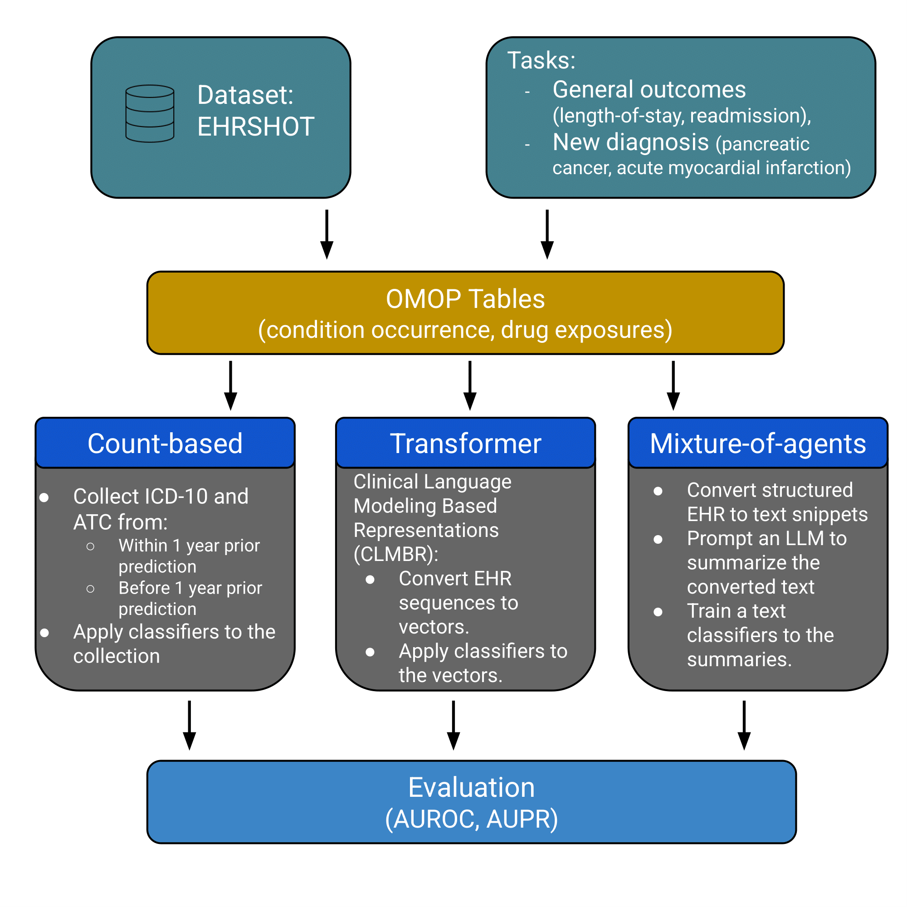

# Count-Based Approaches Remain Strong: A Benchmark Against Transformer and LLM Pipelines on Structured EHR

This repository provides **scripted** pipelines that reproduce the submission **Count-Based Approaches Remain Strong: A Benchmark Against Transformer and LLM Pipelines on Structured EHR**:
1) **Database build** (from raw EHRSHOT OMOP tables)  
2) **Count-based** modeling (LightGBM & TabPFN with time-binned counts and ontology-rollup)  
3) **CLMBR** vector embeddings + classifier  
4) **Mixture‑of‑Agents (MoA)**: LLM summarization → ClinicalBERT classifier

<p align="center">
  <a href="schema.png">
    
  </a>
  <br/>
  <em>Click to view the PDF.</em>
</p>

> **Data not included.** Please place the EHRSHOT assets and OMOP tables locally (see below).

## 0) Environment
```bash
python -m venv .venv && source .venv/bin/activate
pip install -r requirements.txt
```

## 1) Data layout
```
data/
  assets/
    splits/person_id_map.csv
    benchmark/<task>/labeled_patients.csv           # for each task: los, readmission, pancreatic_cancer, acute_mi
  raw_omop/                                         # optional: CSVs for OMOP tables (if you need to rebuild SQLite)
```

### SQLite database
Build the SQLite DB from raw OMOP CSVs (creates only the tables required by our pipelines):
```bash
python -m src.data.build_ehrshot_db   --omop_csv_dir ./data/raw_omop   --out_sqlite ./data/omop_db.sqlite3
```
The script looks for (if present): `person.csv`, `condition_occurrence.csv`, `drug_exposure.csv`, `concept.csv`, `concept_relationship.csv`, `concept_ancestor.csv` and creates reasonable indexes.

## 2) Count‑based baseline (LightGBM & TabPFN)
```bash
python -m src.pipelines.count.run_count   --sqlite_path ./data/omop_db.sqlite3   --assets_root ./data/assets   --task acute_mi   --visit_anchor earliest   --models both   --out_dir ./outputs/count/acute_mi_earliest
```
**What it does.**
- Anchors each patient at the earliest (or latest) labeled visit.  
- Aggregates **conditions** (ICD‑10 category roll‑ups) and **medications** (ATC roll‑ups) into **two time bins**: recent (≤365d) and history (>365d).  
- Trains **LightGBM** and **TabPFN**; reports **AUROC** and **AUPR** on the official test split.

## 3) CLMBR pipeline
```bash
python -m src.pipelines.clmbr.run_clmbr   --sqlite_path ./data/omop_db.sqlite3   --assets_root ./data/assets   --task acute_mi   --visit_anchor earliest   --out_dir ./outputs/clmbr/acute_mi_earliest
```
**What it does.**
- Tokenizes the longitudinal event stream up to the anchor time and produces a **patient vector** `r_i`.  
- Trains a classifier (LightGBM by default) on `r_i`.  

## 4) Mixture‑of‑Agents (MoA): Qwen summaries → ClinicalBERT
**A. Summarize structured events with Qwen**
```bash
python -m src.pipelines.moa.summarize_qwen   --sqlite_path ./data/omop_db.sqlite3   --assets_root ./data/assets   --task acute_mi   --visit_anchor earliest   --run_tag seed2   --cache_dir ./hf_cache
```
This produces:
```
outputs/intermediate/df_event_MoA_qwen_<task>_<run_tag>.csv
outputs/intermediate/dic_pid_row_llm_MoA_qwen_<task>_<run_tag>.pickle
```

**B. Prepare train/val/test splits for ClinicalBERT**
```bash
python -m src.pipelines.moa.prepare_splits   --assets_root ./data/assets   --intermediate_root ./outputs/intermediate   --task acute_mi
```
This writes:
```
outputs/intermediate/<task>_<run_tag>_train.csv
outputs/intermediate/<task>_<run_tag>_val.csv
outputs/intermediate/<task>_<run_tag>_test.csv
```

**C. Train & evaluate ClinicalBERT**
```bash
python -m src.models.clinicalbert_predictor   --train_csv outputs/intermediate/acute_mi_seed2_train.csv   --val_csv   outputs/intermediate/acute_mi_seed2_val.csv   --test_csv  outputs/intermediate/acute_mi_seed2_test.csv   --out_dir   outputs/models/moa_clinicalbert_acute_mi_earliest
```

## 5) One‑shot scripts
Convenience shell scripts call the steps above in the right order for one task.
```bash
bash scripts/run_count.sh  acute_mi earliest
bash scripts/run_clmbr.sh  acute_mi earliest
bash scripts/run_moa.sh    acute_mi earliest
```